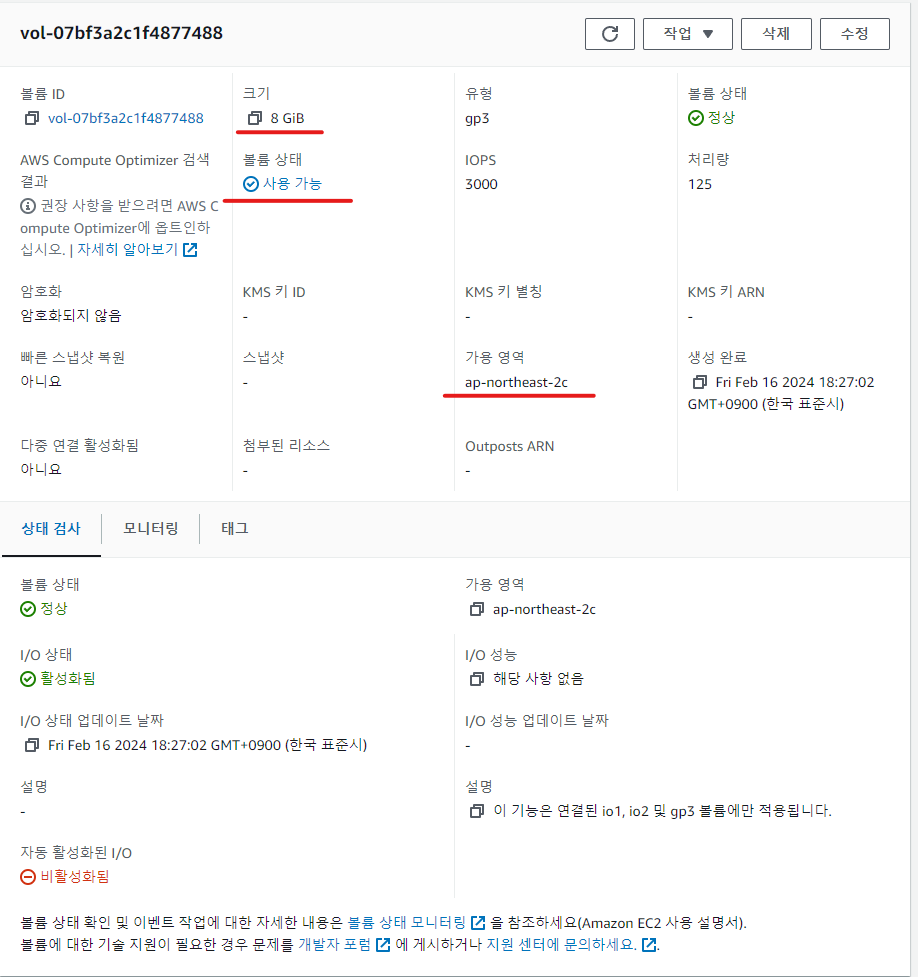

# 1. 클라우드, AWS  

### 클라우드 컴퓨팅 개념 설명해보기  
- 물리적으로 존재하는 컴퓨팅자원을 가상화하여 온라인상의 유동적인 컴퓨팅 자원으로 만들고 이를 접속하여 활용하는 것
### 리전, 가용 영역, 엣지 로케이션 개념 설명해보기
- 리전  
  AWS 서비스가 운영되는 지역으로 가장 큰 범위의 분류이며 각 리전에는 가용 영역이라는 이름으로 서비스의 안정성과 가용성을 위해 이중화 구성이 되어있다. 
- 가용 영역  
  각 가용 영역은 개별 데이터센터로 물리적으로 분리되어있다.
- 엣지 로케이션  
  빠른 서비스를 위한 캐시서버들이 운영되는 데이터 센터이다. 
### 클라우드의 종류 설명해보기 (힌트. 피자를 먹는 네 가지 방법)
- On-Premises  
  서비스에 필요한 모든 컴퓨팅 자원을 물리적으로 보유하고 유지보수를 하는 것
- Infrastructure  
  서비스에 필요한 하드웨어, 운영체제 및 소프트웨어 중 하드웨어에 속하는 부분만 활용하는 것 
- Platform  
  서비스에 필요한 하드웨어, 운영체제 및 소프트웨어 중 하드웨어 및 운영체제를 활용하는 것 
- Software  
  서비스에 필요한 하드웨어, 운영체제 및 소프트웨어를 모두 활용하여 사용자는 서비스에 필요한 컨텐츠만 필요하다. 

# 2. EC2  
- EC2 인스턴스 생성하기 (서울 리전, Ubuntu, t2.micro)  

- ssh로 접속하기  

- 3000번 포트를 누구나 접속 가능하도록 보안 규칙 추가하기  

- EC2 인스턴스 종료하기

# 3. Elastic IP
- EC2 인스턴스 생성하기 (서울 리전, Ubuntu, t2.micro)  

- Elastic IP 할당 받기  

- 할당 받은 Elastic IP를 EC2 인스턴스에 연결하기  

- 연결한 이후 Elastic IP를 통해 ssh 접속하기  

- 할당 받은 Elastic IP 릴리즈 하기  

- EC2 인스턴스 종료하기  

# 4. EBS
- EC2 인스턴스 생성하기 (서울 리전, Ubuntu, t2.micro)  

- EBS 볼륨 생성 하기 (EC2 인스턴스와 같은 리전+가용영역, 용량은 8GB)  

- EC2 인스턴스에 EBS 볼륨 연결하기  

- EC2 인스턴스에서 EBS 볼륨 제거하기  

- EBS 볼륨 삭제하기  

- EC2 인스턴스 종료하기  
