# AWS Day6  

### S3(정적 웹사이트 호스팅)
- S3 버킷 생성하기 (서울 리전)
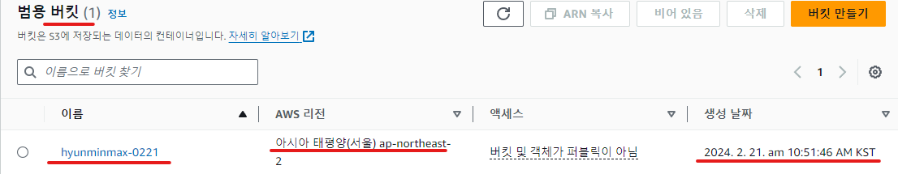
- 버킷의 정적 웹사이트 호스팅 활성화 하기
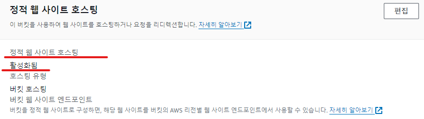 
- 생성한 버킷에 간단하게 작성한 index.html 파일 업로드 하기
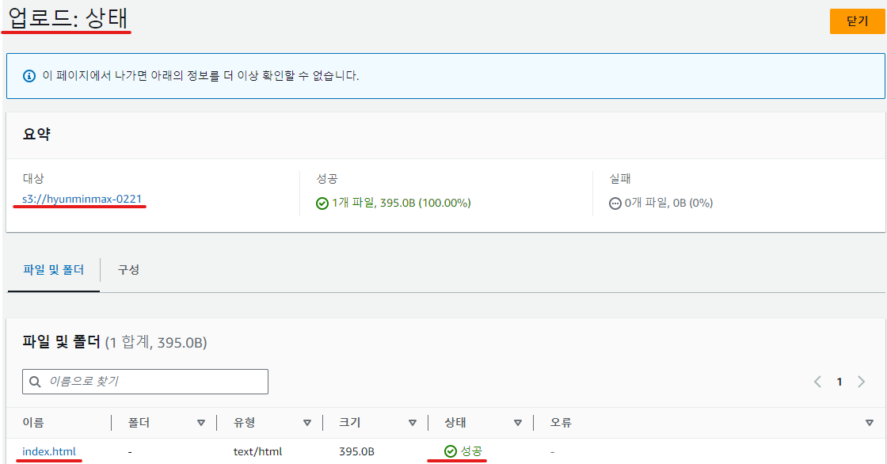 
- 버킷의 퍼블릭 액세스 차단 해제하기
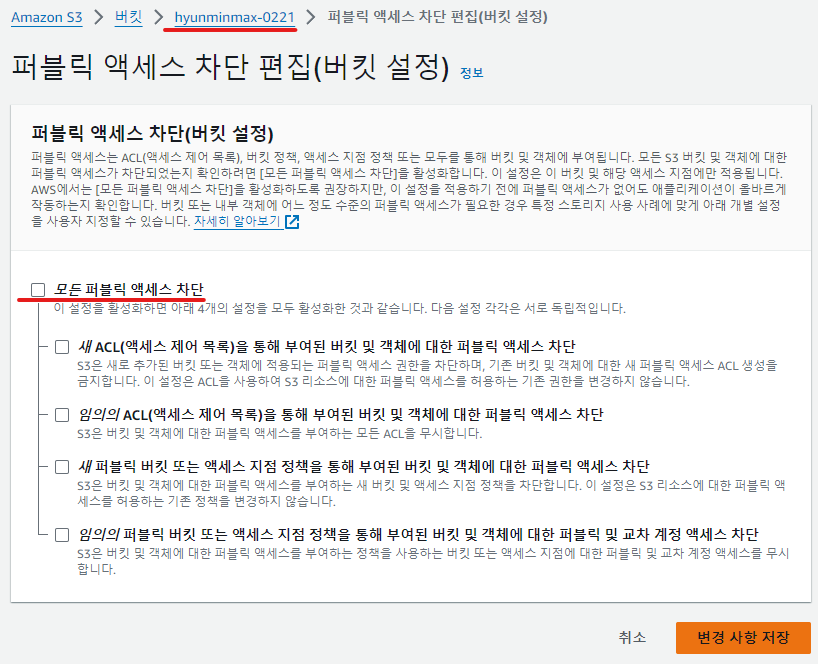 
- 버킷 정책 편집하기 (외부에서 모든 객체에 접근할 수 있도록)
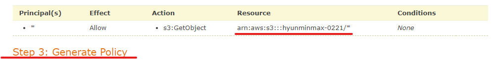 
- 버킷 웹 사이트 엔드포인트로 접속하여 웹 사이트가 잘 나오는지 확인하기
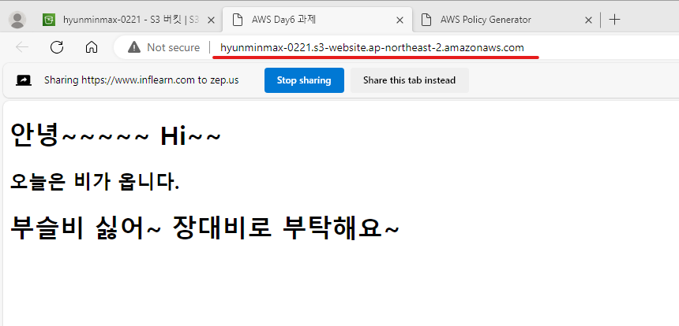 
- 버킷 삭제하기  
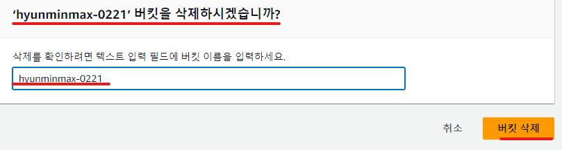 

### CloudFront  

- S3 버킷 생성하기 (서울 리전)

- 생성한 버킷을 origin으로 하는 CloudFront 배포 생성하기 (원본 액세스 제어 설정 포함)
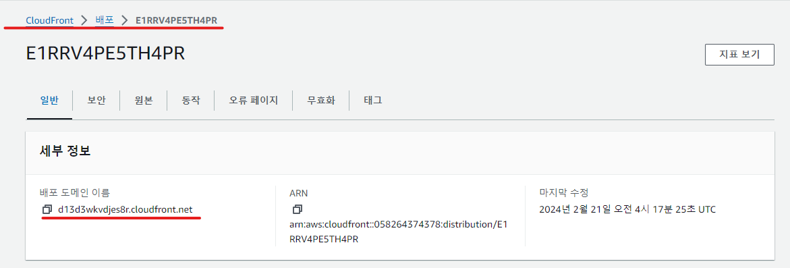 
- 배포 생성 후 S3 버킷 정책 업데이트 하기 (CloudFront가 버킷의 모든 객체에 접근할 수 있도록)
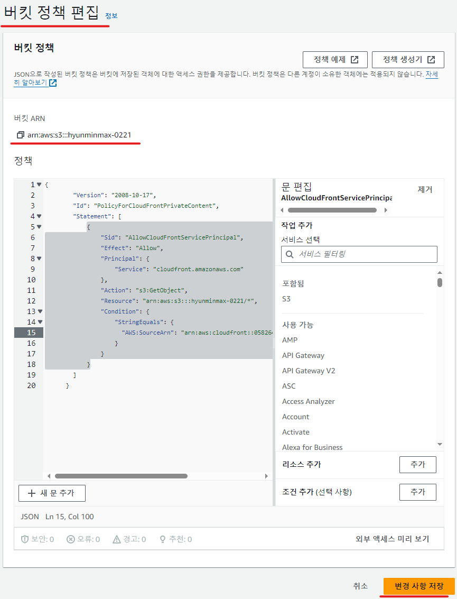 
- CloudFront 배포 도메인 이름으로 접속하여 객체가 잘 나오는지 확인하기
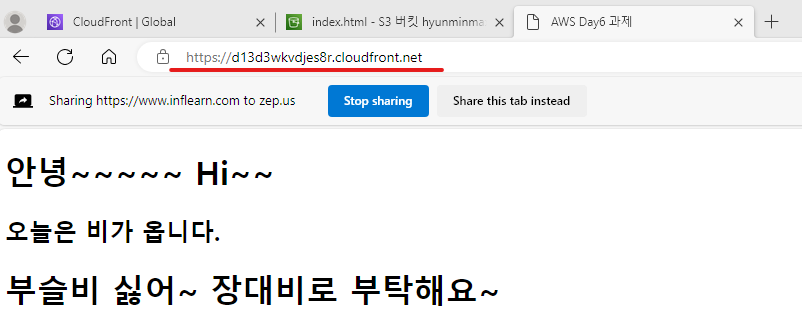 
- CloudFront 배포 및 S3 버킷 삭제하기  
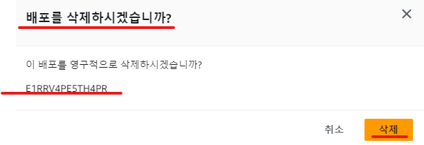
 

### Route 53  
- 호스팅 영역 생성하기  
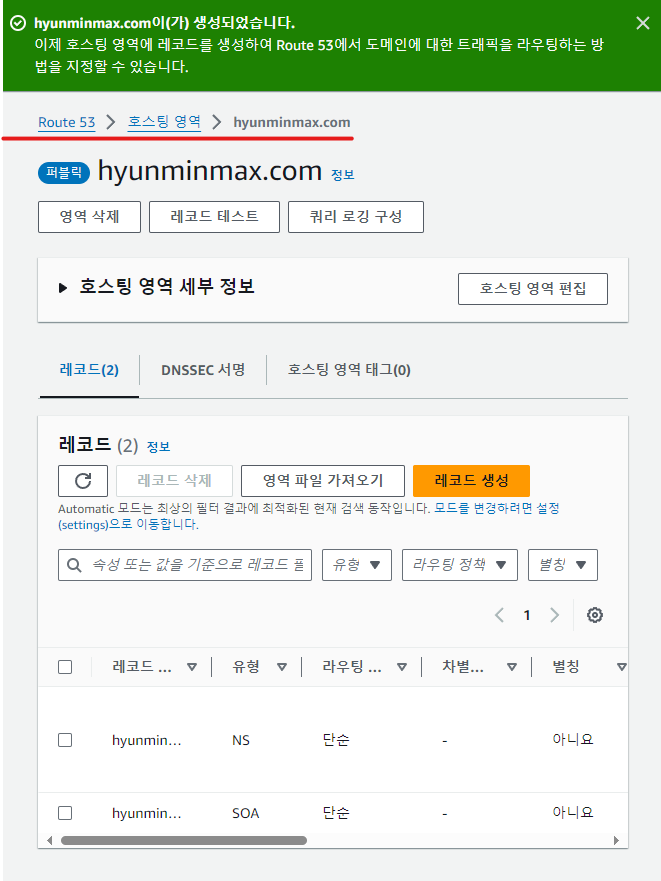 
- A 레코드 추가하기
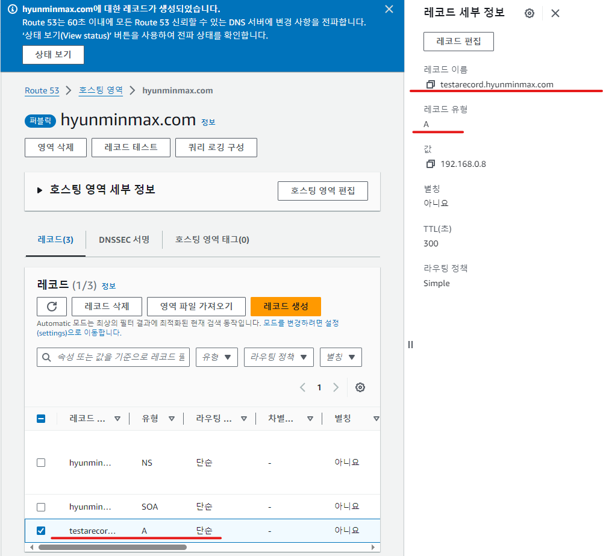 
- CNAME 레코드 추가하기
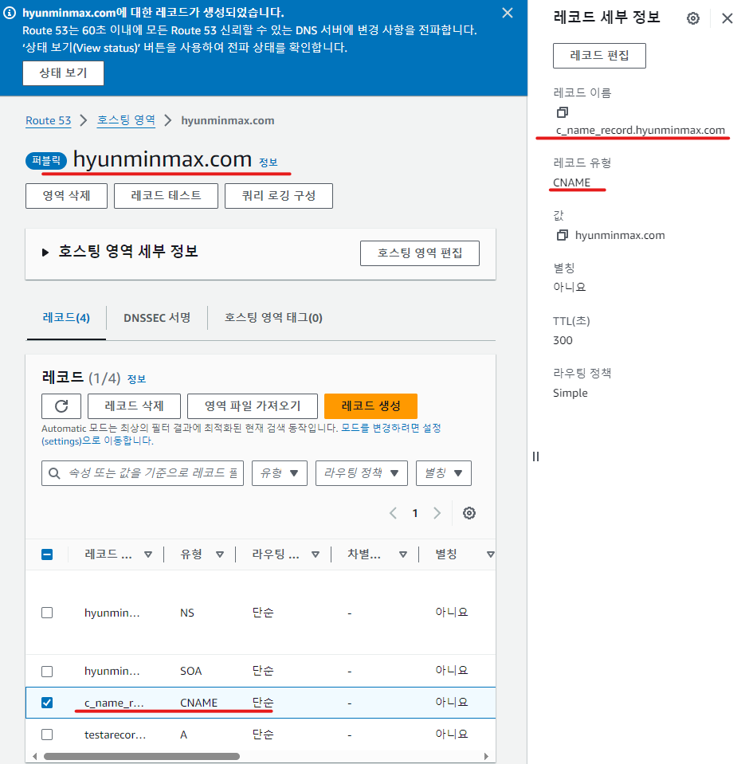 
- NS, SOA 레코드를 제외한 모든 레코드 삭제하기  
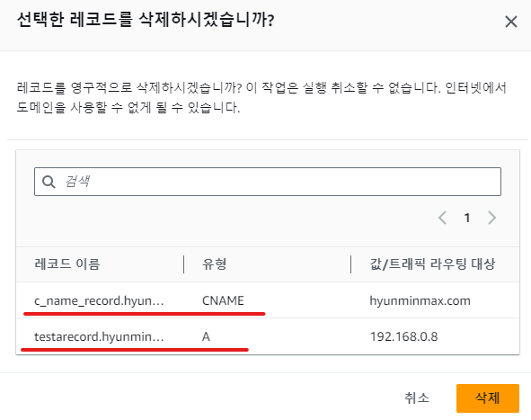 
- 호스팅 영역 삭제하기  
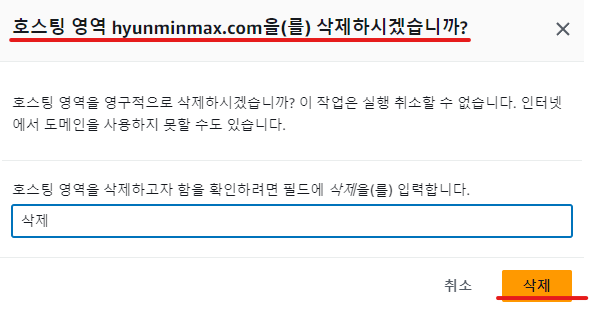 

### IAM  

- IAM 사용자 생성하기 (Management Console 액세스, EC2ReadOnlyAccess 권한 포함)
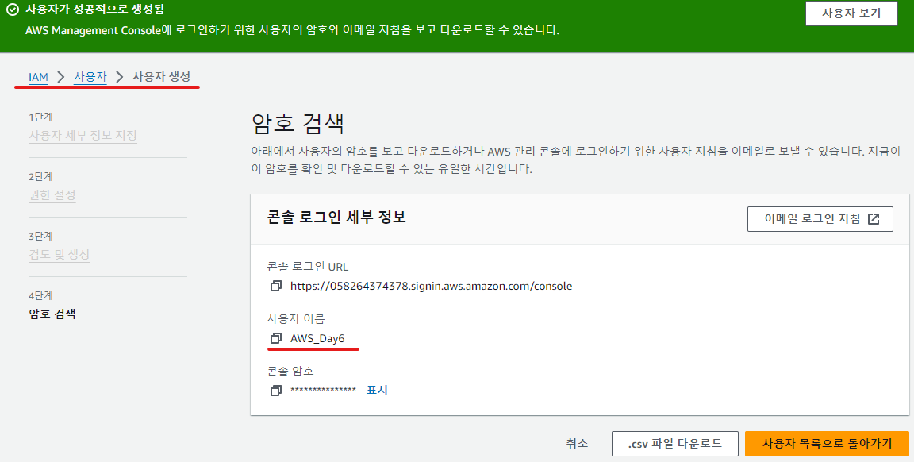 
- 생성한 IAM 사용자로 AWS 콘솔 로그인하기
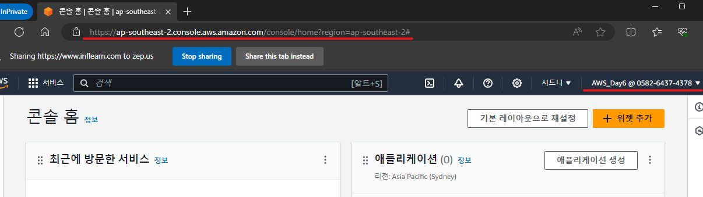 
- EC2 페이지 접속해서 잘 나오는지 확인하기
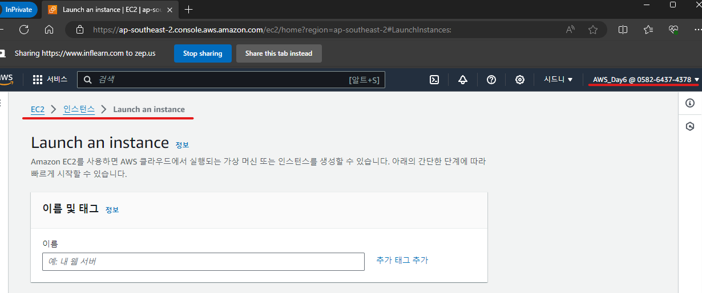 
- IAM 사용자 삭제하기  
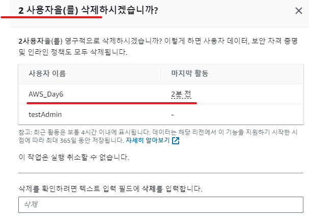 