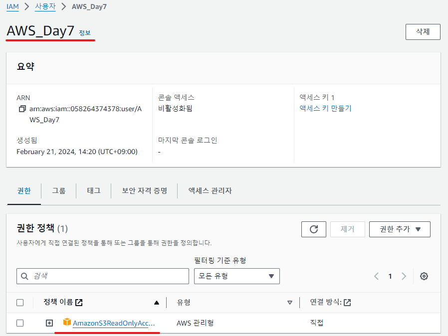
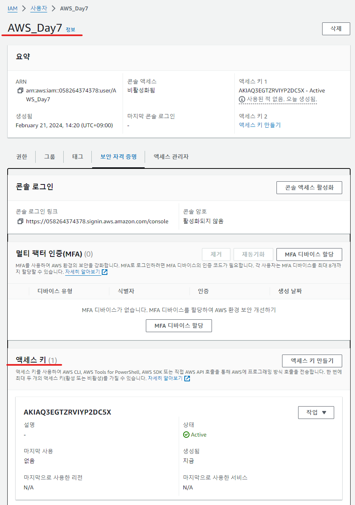
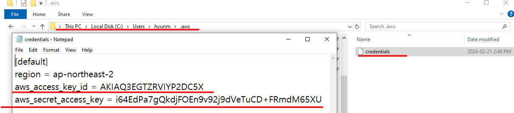
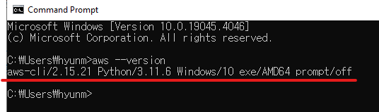
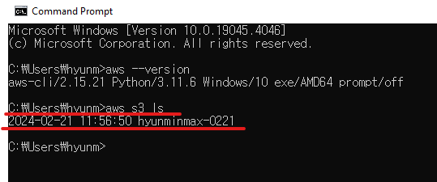
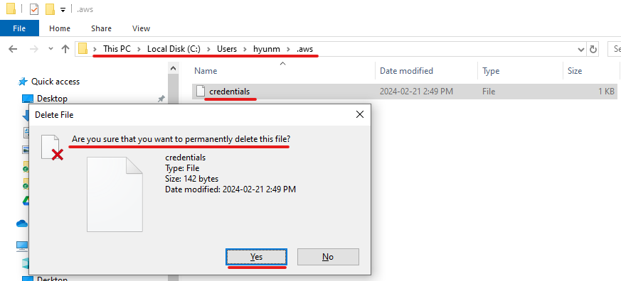
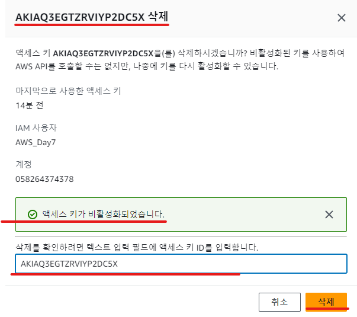
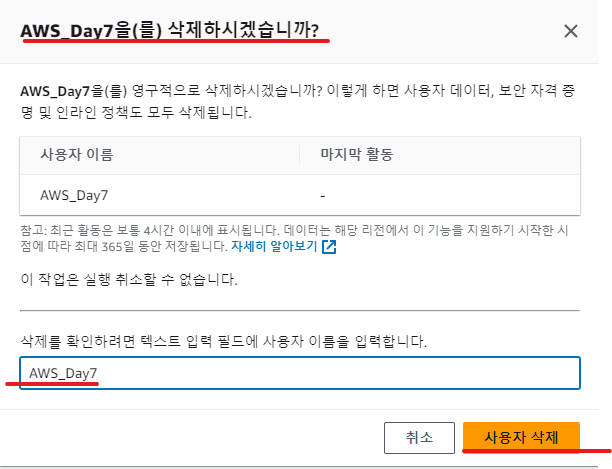

# AWS Day7    
  
### AWS SDK, CLI (공유 자격 증명 설정)  
  
- IAM 사용자 생성하기 (S3ReadOnlyAccess 권한 포함)  
   
- 생성한 IAM 사용자에 액세스 키 만들기 (CLI 용도)  
   
- 생성한 액세스 키를 사용하여 사용 중인 컴퓨터에 공유 자격 증명 설정하기  
    
- AWS CLI를 설치하여 S3 명령어 테스트 해보기  
  
  <em>__AIM 사용자 생성시 S3ReadOnlyAccess권한만을 포함했기에 Bucket 확인만 가능__</em>  

  
   
- 공유 자격 증명 제거하기  
   
- IAM 사용자 삭제하기    
    
    
[# 목차로 돌아가기 #](#aws-day7)  
  
  
  