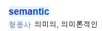

# Semantic Markup 시멘틱 마크업에 대한 공부
##### 제가 나름의 생각정리를 하는 것이지 논문을 적는것이 아니기에 잘못되거나 적절하지 않은 비유가 있을수 있습니다.<br>댓글로 잘 알려주시면 감사하겠습니다. ^^;

### 1. Semantic Markup이란?
> 의미론적인 마크를 하는 태그  

&nbsp;&nbsp;&nbsp;&nbsp;모든 책을 읽을 때 반드시 만나게 되는 것은?  
***바로 책의 제목, 목차, 작자등의 내용이 있다.***  
***Semantic Markup은 이런 구조를 만들어 주는 것과 같다.***  
전문서적, 소설책 그리고 잡지에도 있는 것들이다. 혼자만의 책인 일기를 제외하고 모든 책에 있다.  
별것 아닌 너무나 당연한 이런 구분이 없이 수 백, 수 천의 단락들이 펼쳐져 있다면 그것은 자료와 데이터가 아닌 그냥 글자일 뿐이다. 

요즘은 chatGPT와 같은 AI들이 거의 다 대신 찾아준다곤 하지만 개발자의 길로 들어서서 수 없이 많은 문서들을 찾고 또 찾는 것이 현실인데 그 페이지들에 어디서부터 어디까지가 어떤 내용이 있는지를 표시주는 목차와 같은 것이 없다면 아무리 우리에게 "Ctrl + F"가 있지만 정확한 표현을 모른다면?  
시멘틱 마크업은 이런 문서에 목차와 같은 구분을 만들어줘서 가독성과 활용성을 높이는 표식이라 볼 수 있다. 

### 2. Semantic Markup이 필요한 이유
***바로 다른 개발자들과의 협업과 검색에 필요하기 때문이다.***
우리가 일기를 쓸 때는 온전히 나만의 세상이다. 지금 이 글도 나 혼자만 보려고 했다면 이런 순서는 필요가 없는 것이다.
역시 프로그램이나 웹개발을 하는 경우에도 마찬가지이다. 1인개발자이고 딱 한 번 작성해서 사용하고 다시는 재활용하지 않는 그런 일회성의 프로그램이나 페이지라면 필요가 없지만 다른 기획자의 기획안을 따라서 여러명의 개발자와 디자이너들이 함께 일을 한다면 필수라고 생각한다.  
인터넷이 활성화되기 시작하는 90년대말 2000년대 초에 우리나라에서는 인터넷에서 검색을 잘하는 사람임을 증명하는 자격증 같은 것이 있었던 것으로 기억한다.  
인터넷에 넘쳐나는 정리되지 않아 그냥 글자에 불가한 것들 속에서 우리는 일일이 자료를 찾아야 했지만 요즘은 그 일을 검색엔진과 AI들이 사람이 검색해보기도 전에 미리 인터넷상에 올라온 새로운 정보들을 분석하고 또는 크롤링을 통해서 정확한 자료가 포함되어 있는 사이트인지를 파악하고 있다. 이런 검색에서도 역시 검색엔진과 AI들에게 이 페이지는 논리적으로 잘 구성이 되어있어 분석하기가 편하다는 것을 어필하는 것과 같은 효과가 있을 것이다. 또 그렇게 판단되어 다른 사람의 검색 결과로 제공되었을때 실제 데이터를 접하는 사용자도 비슷하게 느끼게 될 것이다. 

### 3. Semantic Markup의 종류
가장 대표적인 시멘틱 태그로는  
```html
<html>
    <head>

    </head>
    <body>
        <header>
            
        </header>
        <main>

        </main>
        <footer>

        </footer>
    </body>
</html>
```

HTML 문서를 작성 할 때 절대 빠질수 없는 모습이라고 볼 수 있다.  
저 중에서 \<body>부분의 \<header>, \<main>, \<footer>가 바로 시멘틱 코드들이다.  

#### 헤더 Header
***\<header>는 책의 표지와 머릿말 정도로 생각하면 될 것 같다.***  
거의 전세계의 모든 웹페이지가 페이지 상단부분에 회사나 사이트를 대표하는 로고와 정체성 그리고 전체적인 사이트의 굵직한 항목을 넣어 \<header>에 해당하는 부분만 보아도 이 페이지에는 어떤 정보들을 얻을수 있을지 유추해 볼 수 있다.  

#### 메인 Main 
***\<main>은 책의 본문 내용이다.***  
책의 내용 부분으로 볼 수 있다. 웹페이지의 실질적인 내용이 표시되는 곳이다.  
목차를 지나고 나서 책의 본문 내용을 처음부터 읽어 내려가다 보면 각 장으로 구역을 나누는 부분들이 있다.  
이런 일반적인 구분을 하는 것이 \<section>이다.  
반면 \<article>은 사이트내에서 다른 페이지의 썸네일을 표시하는 부분으로 생각하면 편리하다.  
한권의 책에서 전체적인 흐름은 같지만 각각의 다른 주제를 가지고 있는 부분이나 한편의 영화에 짧은 단편이 엮여있는 옴니버스 영화를 생각해보면 그 안의 각각의 영화는 옴니버스 영화의 각 \<article>과 같다. 

#### 풋터 Footer  
***\<footer>는 책의 마지막에 있는 출판사 정보나 영화의 크래딧과 같다.***  
책의 마지막에는 출판사의 위치, 연락처, 기획자, 책의 정확한 정보인 IBSN(국제표준도서번호) 그리고 저작권이 있으니 법의 보호를 받는 다는 말이 있고  
영화에는 마지막 크레딧이 올라가며 누가 어떤 역할을 했으며 어디서 어떤 법규를 지키며 영화를 제작했다는 말이 있다.  
사이트 역시 같다. 사용자에게 전통적인 서비스를 제공하는 사이트들의 마지막에는 항상 회사의 위치, 연락처, 대표, 이 사이트가 준수하는 표준과 법령들이 있다. 

### 4. Semantic Markup의 사용법


